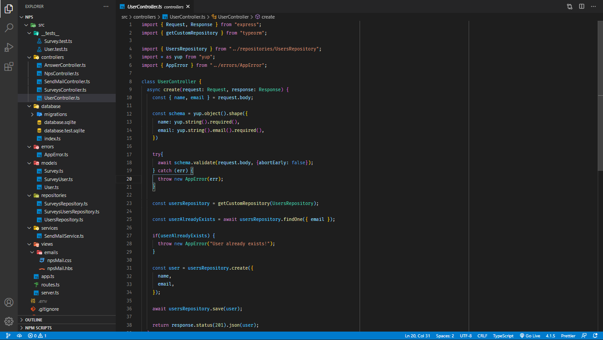

<h1 align="center">NPS</h1>

  <a href="#-Tecnologias">Tecnologias</a>&nbsp;&nbsp;&nbsp;|&nbsp;&nbsp;
  <a href="#-Projeto">Projeto</a>&nbsp;&nbsp;&nbsp;|&nbsp;&nbsp;
  <a href="#-como-executar">Como executar</a>&nbsp;&nbsp;&nbsp;|&nbsp;&nbsp;
  <a href="#-Licença">Licença</a>

  
  
  

  
 
 

  
 

 
 ## 🖥️ Projeto
 
 O NPS é uma aplicação que consite em calcularo NPS dde uma empresa. Nele é feito o
 cadastro de usuários, pesquisas, envio de e-mails para os usuários responderem as 
 pesquisas de satisfação possibilitando realizar o cálculo do NPS.
 
 Esee projeto foi desenvolvido durante a trilha NodeJS, na quarta edição da NLW, onde 
 pude ter um contato mais abrangente sobre o NodeJS. Neste evento, pude conhencer alguns
 conceitos sobre APIs, TypeScript e o Express.
 
 
 
 ## 💡 Tecnologias
  Esse projeto foi desenvolvido  com as seguintes tecnologias:
  
  - [SQL Editor Beekeeper Studio](https://www.beekeeperstudio.io/)
  - [Ethereal-Email](https://ethereal.email/)
  - [TypeORM](https://typeorm.io/#/)
  - [Jest](https:/jestjs.io/)
  - [TypeScript](https://typescriptlang.org/)
  - [Express](https://expressjs.com/pt-br)
  
  
 ## 🚀 Como Executar
 
 - Clone o Repositório
 - Instale as depndências
 - Inicie o Servidor com `yarn start`
 
 A aplicação pode ser acessada em [`localhost:3000`](`http;//localahost:3000`).
 
 
 ## 🧾 Licença
 
 Este projeto está sob a licensa MIT. Para saber mais veja o arquivo [License](LICENSE.md).
 
 ---
 
 Feito de ❤️ por Arthur Nogueira [Linkedin](https;//www.linkedin.com/in/arthur-nogueira-).
  
